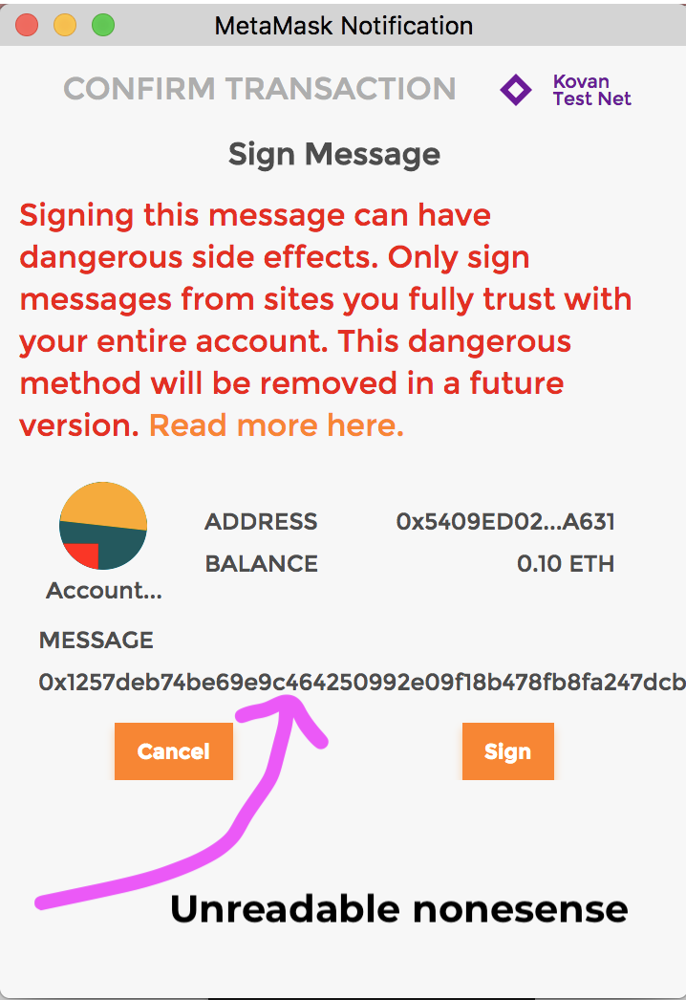

## Wtf is EIP-712?

When signing messages in our wallets, our web3 wallets would ask us to sign the raw unreadable data:

 

 

So, we as a community decided we would format our data the exact same way, so that wallets had an easier time showing us what we are signing. Like the image here. 

 

 

Check out the comments for more information. 

Openzeppelin makes all of this easier with `MessageHashUtils.sol``